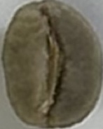
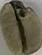

<p align="center">
  
</p>

<h1 align="center">☕ Cofe_log：咖啡豆良品分類器 | Coffee Bean Classifier</h1>

<p align="center">
  利用深度學習模型，辨識咖啡豆的良品與瑕疵豆。<br>
  Use deep learning to classify good and defective coffee beans.
</p>

---

## 📂 專案結構 | Project Structure

```
Good-or-Bad-CoffeeBeans/
├── crop_coffee_beans/
│ ├── coffee_beans_photo/ # 原始圖片 | Raw photos
│ ├── corp_augmented_data/ # 含咖啡豆背面照片背景擴增 | Augmented with background
│ │ ├── back/
│ │ ├── bad/
│ │ └── good/
│ ├── corp_augmented_dataNoback/ # 不含咖啡豆背面照片 | Background removed
│ │ ├── bad/
│ │ └── good/
│ └── crop/
│ ├── classByhands/ # 人工分類（含咖啡豆背面照片）| Manual labeling
│ └── classByhandsNoback/ # 人工分類（不含咖啡豆背面照片）| Manual labeling
├── test/ # 測試圖片 | Test images
├── *.pth # 訓練完成模型 | Trained models
├── data_augment.ipynb # 資料增強腳本 | Data augmentation
├── use_cnn_train.ipynb # 自訂 CNN 訓練 | Custom CNN training
├── use_OpenCV.ipynb # OpenCV 裁切照片 | Image cropping via OpenCV
└── README.md
```

---

## 🧠 模型資訊 | Model Info

- 框架 | Framework：**PyTorch**
- 架構 | Architecture：自定義 CNN
- 增強 | Augmentations：
  - 旋轉 / 翻轉 / 色彩變化 / 模糊 / 雜訊
- 訓練策略 | Training Strategy：
  - 使用 EarlyStopping 儲存最佳權重

---

## 🧪 功能介紹 | Features

| 功能 | 描述 |
|------|------|
| 📦 資料處理 | 對咖啡豆圖片進行標準化、分類、增強 |
| 🔬 模型訓練 | 使用 CNN 訓練良品 vs 瑕疵 |
| 🧪 模型評估 | 分類報告、混淆矩陣、視覺化結果 |
| ⚙️ 模型應用(尚未完成) | 可應用於實驗、分級流程或即時檢測 |

---

## 📊 資料集類別 | Classes
由我本人拍攝，透過opencv裁切後手工挑選。
- `good`：外觀完整，顏色自然的好豆(我本人挑選的，非絕對專業!)
  *(good beans with intact and natural appearance)*
  *(Note: Manually selected; may not be professionally certified)*  
- `bad`：破裂、霉變、色澤異常的瑕疵豆(我本人挑選的，非絕對專業!)
  *(defective beans with damage or discoloration)*
  *(Note: Manually selected; may not be professionally certified)*

---

## 🖼️ 圖示展示 | Sample Images

### Good Bean


### Bad Bean


---

## 🎯 未來規劃 | Future Plans

- [ ] 加入多視角融合（雙鏡頭）
- [ ] 模型部署為 Web 或 Mobile 應用

---

## 👨‍💻 開發者資訊 | About the Developer

- 作者 | Author：dachen8173
- 技術棧 | Stack：Python / PyTorch / OpenCV / Jupyter
- 聯絡方式 | Contact：op.dada.op@gmail.com

---

## 📜 授權 | License

MIT License – 歡迎使用、改進並回饋社群！  
MIT License – Feel free to use, modify, and contribute.
